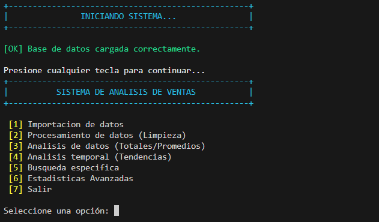

# Análisis de Ventas

## Descripción
Aplicación de consola en Haskell para procesar datos de ventas, calcular estadísticas y generar salidas JSON.

## Objetivo
Practicar programación funcional, transformacion de datos y cálculo de indicadores comerciales.

## Tecnologías utilizadas
- Haskell
- Stack
- Cabal
- JSON
- Hspec

## Funcionalidades principales
- Carga y procesamiento de ventas
- Cálculo de resumen y categorias
- Transformacion de datos en módulos separados
- Pruebas automatizadas

## Mi rol
Implementé tipos de datos, funciónes de procesamiento, estadísticas e interfaz de consola.

## Aprendizajes clave
- Tipos algebraicos
- Separación funcional
- Stack/Cabal
- Resultados reproducibles en JSON

## Instalación y ejecución
```bash
cd AnalisisDeVentas/programa
stack setup
stack build
stack run
stack test
```

## Estructura del proyecto
- programa/app/Main.hs: entrada
- programa/src/: módulos
- programa/src/data/: JSON
- programa/test/: pruebas

## Capturas o demo


## Estado del proyecto
Proyecto académico funcional.

## Valor técnico demostrado
Evidencia manejo de programación funcional y procesamiento de información orientado a analitica.

## Mejoras futuras
- Documentar formato JSON
- Agregar importacion CSV si aplica
- Incluir reportes visuales

## Autor
Geovanni González  
Estudiante de Ingeniería en Computación  
GitHub: [Geovanni-Gonzalez](https://github.com/Geovanni-Gonzalez)


